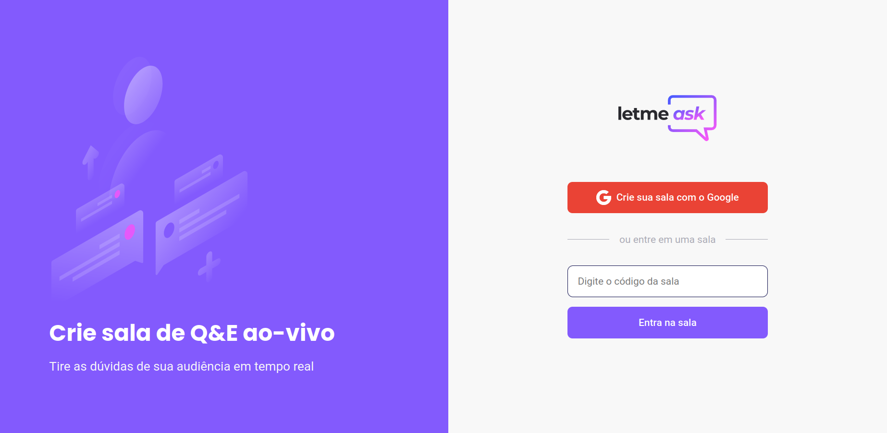
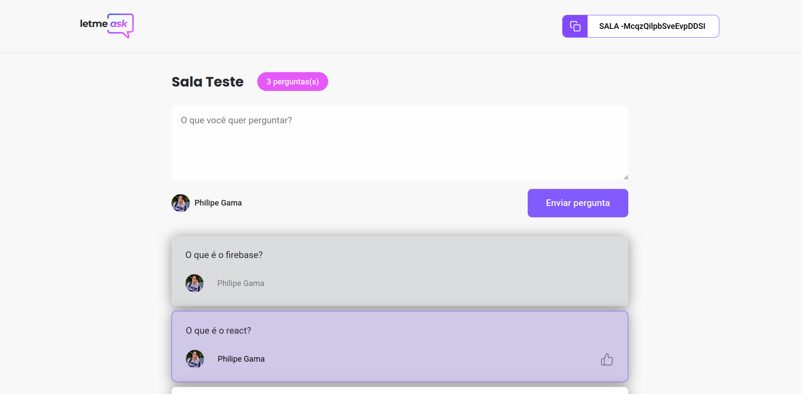
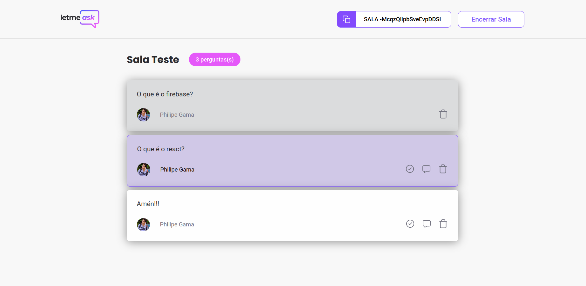

<p align="center">
  
</p>


<h4 align="center">
🚧 NLW#6 - Trilha ReactJS - Letmeask 1.0 🚀 em construção... 🚧
</h4>

---

#### 🚀 Sobre o Projeto

O Letmeask é uma plataforma que tem a proposta de resolver problemas de acumulo de perguntas durante uma live, transmissão, etc. Com ela você pode criar salas privadas onde somente os que possuem o ID da sala podem acessar, os participantes podem fazer perguntas(desde que estejam logados com o Google), votar nas mesmas. Já o criador da sala pode demarcar as perguntas como respondidas, colocar foco, dentre outras funcionalidades.

---

#### 🚀 O que é Next Level Week?

O [NLW](https://nextlevelweek.com/inscricao/6) é uma semana prática com muito código, desafios, network e com um único objetivo: levá-lo ao próximo nível.
Através do método da [Rocketseat](https://rocketseat.com.br/), você aprenderá novas ferramentas, tecnologias e descobrirá hacks que irão impulsionar sua carreira.
Um evento online e totalmente gratuito que o ajudará a dar o próximo passo na sua evolução como desenvolvedor.

---

#### 📋 Funcionalidades

- [x] Como participante
  - [x] Logar com sua conta do google.
  - [x] Criar uma nova sala.
  - [x] Fazer perguntas e enviar.
  - [x] dar like nas perguntas
  - [x] botão para copiar o código da sala.
- [x] Como administrador da sala
  - [x] Pode excluir pergunta.
  - [x] Pode encerrar a sala.
  - [x] Responder as perguntas.

---


#### 🎨 Layout

O layout da aplicação está disponível no Figma:

<a href="https://www.figma.com/file/MT8UU8XfDDCQ3LSrl4PXpE/Letmeask-(Copy)?node-id=0%3A1">
  
</a>

Design feito por [Rebecca Gonzalez](https://dribbble.com/rebeccagonzalez)

---

#### :computer:  Web

<h4 align="center">
  
  <p align="center">Tela inicial - letmeask<p>
</h4>
<h4 align="center">
  
  <p align="center">Tela de perguntas - letmeask<p>
</h4>
<h4 align="center">
  
  <p align="center">Tela Admin - letmeask<p>
</h4>

---

#### 📱 Mobile

<h4 align="center">
  Em breve
</h4>

---

#### :crossed_swords: Desafios para melhorar a aplicação
- [ ] Criar documentação
    - [ ] Vídeo de exemplo
    - [x] Readme-me incrível
    - [x] Setup do projeto
    - [x] Funcionalidades
    - [ ] Screenshot das páginas
 - [ ] Melhorar estilos
    - [ ] Alguns ajustes para tornar o estilo igual ao layout
    - [ ] Adicionar media queries
    - [ ] Deixar o layout responsivo para mobile, tablet e Desktop
    - [ ] CSS com Styled Components e Mobile First
    - [ ] Switch para alterar os themes
    - [ ] Theme dark na aplicação
    - [ ] Criar modal de encerrar sala
    - [ ] Toast como notificação
    - [ ] Save theme no localStorage
  - [ ] Funcionalidades
  
    - [ ] Confirmação de fecha sala
    - [ ] Adicionar login pela Room
    - [ ] Adicionar funcionalidade PWA
  - [ ] Testar a aplicação
    - [ ] Testes com Jest;
    - [ ] Storybook para os component;

---

#### :gear: Tecnologias:

Este projeto foi desenvolvido utilizando as seguintes tecnologias:

- **[React.js](https://pt-br.reactjs.org/)**
- **[TypeScript](https://www.typescriptlang.org/)**
- **[Eslint](https://eslint.org/)**
- **[Prettier](https://prettier.io/)**
- **[Firebase Authentication](https://firebase.google.com/)**
- **[Firebase Realtime Database](https://firebase.google.com/)**
- **[Firebase](https://firebase.google.com/)**
- **[classnames](https://www.npmjs.com/package/classnames)**
- **[React Router Dom](https://reactrouter.com/web/guides/quick-start)**
- **[node-sass](https://www.npmjs.com/package/node-sass)**

---

#### 🚀 Como executar o projeto

##### Pré-requisitos

Antes de começar, você vai precisar ter instalado em sua máquina as seguintes ferramentas:
[Git](https://git-scm.com), [Node.js](https://nodejs.org/en/).
Além disto é bom ter um editor para trabalhar com o código como [VSCode](https://code.visualstudio.com/)

---

#### 👯 Clonando o repositório

```bash
# Clone este repositório
$ git clone https://github.com//PhilipeGama/nlw-06-letmeask

# Acesse a pasta do projeto no terminal/cmd
$ cd nlw-06-letmeask
```

#### 📁 Rodando a Aplicação

```bash
# Instale as dependências
$ yarn or npm install

# Criar um projeto reactjs com typescript
$ yarn create react-app letmeask --template typescript

# Para usar .scss no node v14.*
$ yarn add node-sass@5.0.0

# Para navegar entre as paginas
$ yarn add react-router-dom

# Instalar react-router-dom com typescript
$ yarn add @types/react-router-dom -D

# Execute a Aplicação em Desenvolvimento
$ yarn start or npm run start

# A aplicação será aberta na porta:3000 - acesse http://localhost:3000

```

#### 📁 Configuração .ENV


```bash
#adicionado .env.example no projeto, lembrar de adicionar as variáveis de ambiente conforme o exemplo

# FIREBASE

REACT_APP_API_KEY=
REACT_APP_AUTH_DOMAIN=
REACT_APP_DATABASE_URL=
REACT_APP_PROJECT_ID=
REACT_APP_STORAGE_BUCKET=
REACT_APP_MESSAGE_SENDING_ID=
REACT_APP_APP_ID=

```

---

#### 🔎 Comandos

- `start`: Executa a aplicação em `localhost:3000`
- `build`: Cria a Build do projeto
<!-- - `start`: Inicia um servidor simples com o código de produção -->

---

<!--
### 💾 Comandos Úteis

```bash
#Criação de um componente completo com (index.tsx / stories.tsx / styles.ts / test.tsx)
$ yarn generate ComponentName

#Rodar o Storybook
$ yarn storybook

#Rodar os testes
$ yarn test

```
-->


#### 💪 Como contribuir para o projeto

1. 🍴 Faça um **fork** do projeto.
2. 👯 Clone esse repositório para sia máquina.
3. 🎋 Crie uma nova branch com as suas alterações: `git checkout -b my-feature`
4. ✅ Salve as alterações e crie uma mensagem de commit contando o que você fez: `git commit -m "feature: My new feature"`
5. 📌 Envie as suas alterações: `git push origin my-feature`
6. 🔃 Crie uma nova pull request

Depois que sua solicitação de pull request for mesclada, você pode excluir `your-feature`

> Caso tenha alguma dúvida confira este [guia de como contribuir no GitHub](https://github.com/firstcontributions/first-contributions)

---

##### 🤓 Autor


<div>
<a href="mailto:philipegama97@gmail.com">
      
   </a>
<a href="https://www.linkedin.com/in/philipe-gama-9702231a5/">
      
   </a>
<a href="https://github.com/PhilipeGama">
  
  </a>
</div>
---

##### 📝 LICENÇA

Esse repositório está licenciado pela **MIT LICENSE**. Para mais informações detalhadas, leia o arquivo [LICENSE](./LICENSE) contido nesse repositório.

 <h3 align="center">Readme
baseado no ❤️ de ❤️ <a href="https://github.com/marcelo-rafael/nlw-06-letmeask#readme">Marcelo Rafael Gonçalves 💜🚀</a>
</h3> 


